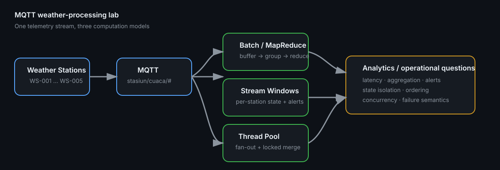

# Distributed Weather Processing — MQTT, Batch, Stream & Parallel Analytics

[](https://github.com/syifaniads/DistributedComputingMQTT/actions/workflows/python-ci.yml)

A distributed-computing coursework lab that consumes smart-weather-station events over **MQTT** and compares three processing styles: **batch MapReduce**, **stateful stream windows**, and **thread-pool fan-out analytics**.

The original assignment/report is preserved in sanitized form, while the current portfolio layer extracts deterministic processing functions, tests event validation and aggregation, removes the historical private broker address, and documents the trade-offs a production stream processor would need to handle.

<p align="center">
  
</p>

> **Visual provenance:** the architecture is derived from the retained subscriber code and report: weather events arrive over `stasiun/cuaca/#`, then are processed as batches, per-station windows, or parallel analytic tasks. It is not a fabricated production deployment screenshot.

## Workload

The retained report describes five weather stations publishing approximately one message per station per second, or roughly **5 events/s** in the lab. Each event contains fields such as:

```json
{
  "station_id": "WS-003",
  "lokasi": "Gedung_C",
  "suhu_c": 32.4,
  "kelembaban_pct": 71.0,
  "aqi": 117,
  "curah_hujan_mm": 0.0,
  "kecepatan_angin": 12.5,
  "arah_angin": "SE"
}
```

## Three processing models

### 1. Batch MapReduce

`subscriber/solution_mapreduce.py` buffers 20 events and then runs:

```text
Map:     event → (station_id, measurements)
Shuffle: group values by station_id
Reduce:  count, temperature avg/max, AQI avg/max, rainfall total
```

At the report's ~5 events/s, a 20-event batch has an expected fill time of roughly **4 s**; increasing the batch to 100 raises that to roughly **20 s** before processing. This illustrates the batch-size trade-off between aggregation stability and result latency. These are workload-derived estimates, not measured end-to-end latency benchmarks.

### 2. Stateful stream processing

`subscriber/solution_stream.py` keeps state **per station** rather than mixing all stations into one global deque:

- sliding window: last 5 events/station;
- tumbling window: 10 events/station;
- event-level alerts for temperature, AQI, wind, and rainfall thresholds.

That distinction matters: state partitioning by `station_id` prevents one station's events from contaminating another station's rolling statistics.

### 3. Parallel fan-out

`subscriber/solution_parallel.py` submits independent analytics for each event to a `ThreadPoolExecutor`: temperature statistics, AQI category, and extreme-weather classification. Shared state is merged under a lock.

This is an educational concurrency pattern, **not a claim that Python threads automatically increase CPU-bound throughput**. Per-event task creation, waiting, the GIL, lock contention, and MQTT callback serialization can erase any speedup. [`docs/ENGINEERING_REVIEW.md`](docs/ENGINEERING_REVIEW.md) discusses that boundary explicitly.

## Run

```bash
python -m venv .venv
source .venv/bin/activate
pip install -r requirements.txt

export MQTT_BROKER=localhost
export MQTT_PORT=1883
python subscriber/solution_stream.py
```

Windows PowerShell:

```powershell
$env:MQTT_BROKER = "localhost"
$env:MQTT_PORT = "1883"
python subscriber\solution_stream.py
```

The repository no longer defaults to the historical private lab IP.

## Tests

```bash
pip install -r requirements-dev.txt
pytest -q
```

The tests cover:

- schema validation;
- AQI boundary categories;
- deterministic batch aggregation;
- per-station sliding-window isolation;
- tumbling-window emission/reset;
- alert generation.

## Senior technical review path

| Review question | Inspect |
|---|---|
| Is processing logic separated from MQTT I/O? | [`subscriber/weather_processing.py`](subscriber/weather_processing.py) |
| How is Map → Shuffle → Reduce expressed? | [`subscriber/solution_mapreduce.py`](subscriber/solution_mapreduce.py) |
| How is per-key stream state managed? | [`subscriber/solution_stream.py`](subscriber/solution_stream.py) |
| Is the parallel implementation actually safe? | [`subscriber/solution_parallel.py`](subscriber/solution_parallel.py), [`docs/ENGINEERING_REVIEW.md`](docs/ENGINEERING_REVIEW.md) |
| What delivery/ordering failures are still possible? | [`docs/PRODUCTION_GAPS.md`](docs/PRODUCTION_GAPS.md) |
| What came from the coursework? | [`laporan.md`](laporan.md), [`docs/PROVENANCE.md`](docs/PROVENANCE.md) |

## Production gaps

A real distributed telemetry pipeline would need explicit MQTT QoS/session semantics, message identity/idempotency, schema/version management, bounded queues and backpressure, reconnect strategy, retained-message policy, event-time/watermark semantics, durable state/checkpointing, late/out-of-order event handling, horizontal partitioning, observability, and load/failure testing.

The lab's batch and window sizes are **count-based**, not event-time windows. That distinction is documented instead of presenting the exercise as equivalent to Kafka Streams/Flink/Spark Structured Streaming.
